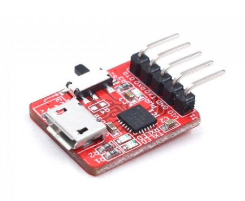

#  4 Channel LoraWAN Relay


```c++
/*
Version:		V1.0
Author:			Vincent
Create Date:	2023/7/28
Note:

*/
```


[toc]

# Makerfabs

[Makerfabs home page](https://www.makerfabs.com/)

[Makerfabs Wiki](https://wiki.makerfabs.com/)


# 4 Channel LoraWAN Relay
## Intruduce

Product Link ：[]() 

Wiki Link : []()

Arduino ATmega328P as MCU, inherited Ra-08 Lorawan module and 4 relays.


## Feature

- LoRaWAN Nodes, RA08H
- Onboard Relays
- Full Open Source- all hardware and software open at GitHub
- Compatible with Arduino
- Supply power voltage: 12V DC


### Front:


### Back:


# Code

## Compiler Options

**If you have any questions，such as how to install the development board, how to download the code, how to install the library. Please refer to :[Makerfabs_FAQ](https://github.com/Makerfabs/Makerfabs_FAQ)**

- Open code with Arduino IDE
- Set Lorawan config in code.
- Upload codes, select "Arduino Pro or Pro Mini" and "3.3V 8MHz"

## Uploader

There is no USB socket or integrated serial port chip on some modules. But there are serial ports: VCC, GND, RX, TX, DTR. 

There are two ways to connect a serial port.


### MakerFabs CP2104 USB2UART

Product link : [CP2104 USB2UART](https://www.makerfabs.com/cp2104-usb-to-serial-converter.html)



This CP2104 USB to Serial Converter is super tiny, a highly-integrated USB-to-UART Bridge Controller providing a simple solution for updating and programming.

The serial port module has the same pin position as the makerfabs module with no USB port. So just plug it into the hole.


The usage of usb cable is the same after that.

### CP2102 MODULES USB TO TTL

There are many common USB serial port modules on the market, which are basically connected in a common way.

| Makerfabs | USB To TTL |
| --------- | ---------- |
| VCC       | 3.3V       |
| GND       | GND        |
| RX        | TXD        |
| TX        | RXD        |


## Testing file for manufacture

**lorawan_328_test.ino**

This is a test demo. You can check all relays and Lorawan.


Change Lorawan config to yourself.

```c++
//config.h

#define DEVEUI "YOUR_DEVEUI"
#define APPEUI "YOUR_APPEUI"
#define APPKEY "YOUR_APPKEY"


```


After connecting 12V DC power supply, all relays will turn on and then turn off.
The Lorawan platform is then automatically connected and the data is sent.


## Example

### 328p_at

Example for AT command test.
The AT command can be sent to the Ra-08 module through the serial port monitor.

### downlink_control

Based on Lorawan Class A model. Each time data is sent to TTN, the set downlink data is received.
Send "F8" to open all relays.
Send "F7" to close all relays.


